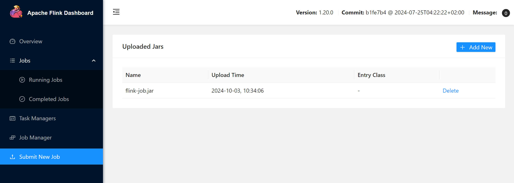
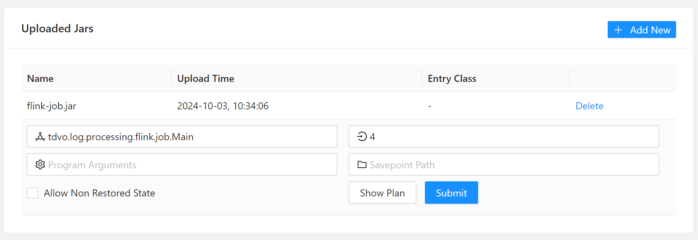
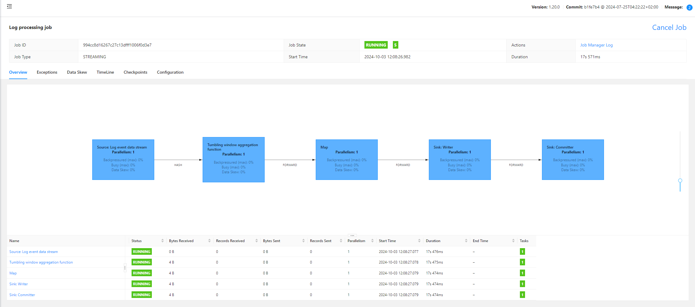

# Apache Flink log processing
Sample project to demonstrate Apache Flink real time data processing. In this example, we will use Kafka as data source and sink, our program will be deployed on a Flink Session Cluster.

## Packages
### Docker
Store a Docker compose file includes 2 services:
* Kafka: Data source and sink for Flink job
* Flink cluster: 1 Job Manager and 2 Task Managers

### Services
#### flink-job
Java code of our logic
#### log-generator
Simple Java program to generate NGINX log at specified throughput

## Example description
Given a streaming of NGINX log, return number of error request, group by client IP, interval = 10s

Log structure:
```
{
    "remoteAddress": "198.51.100.5",
    "httpMethods": "GET",
    "URLPath": "/profile",
    "userAgent": "Chrome/91.0",
    "referer": "-",
    "statusCode": 200,
    "bodyBytesSent": 44737,
    "responseTime": 5.543173,
    "createdTime": 1727411945001
}
```
Sample output:
```
{
    "ipToErrorRequestCount": {
        "198.51.100.5": 10,
        "10.0.0.2": 19,
        "203.0.113.4": 0
    },
    "processedTime": "1727411955001",
    "createdTime": "1727411945001"
}
```
Output will be sent to a specified kafka topic.

## How to run
**0. Tool version**

Java: 11

Kafka: 3.8.0

FLink: 1.20.0

**1. Start all Docker containers in a compose file**
```
cd docker && docker-compose up -d
```

**2. Create kafka topic to store data (Omit if already created)**
* _log-event_: Store generated log event
* _log-processing-output_: Store output of log processing
```
### Access container terminal 
docker exec -it 2628679c7f1d182510964503425b6ea491cd66766f5171ffcb1c86ba430e3bfc /bin/bash
### Create topic
opt/kafka/bin/kafka-topics.sh --create --topic log-event --bootstrap-server localhost:9092
opt/kafka/bin/kafka-topics.sh --create --topic log-processing-output --bootstrap-server localhost:9092
```

**3. Execute generating NGINX log**
```
./gradlew services:log-generator:run --args='10000000000 1'
```
**Note: You can change argument base on your demand: 1st argument is total log events, 2nd argument is expected throughput (approximately)

**4. Build Flink job program fat-JAR file**
```
./gradlew services:flink-job:jar
```

**5. Open Flink Cluster dashboard**
Open link [Apache Flink Cluster dashboard](http://localhost:8081)

**6. Submit fat-JAR file to execute processing**





Click **Submit** button to start a job



Monitor a running job

**7. Monitor output on _log-processing-output_ topic**
```
### Access container terminal 
docker exec -it 2628679c7f1d182510964503425b6ea491cd66766f5171ffcb1c86ba430e3bfc /bin/bash
### Monitor output data
opt/kafka/bin/kafka-console-consumer.sh --topic log-processing-output --bootstrap-server localhost:9092
```


